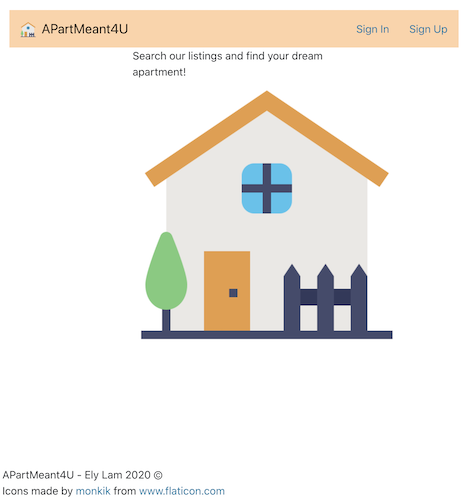

# APartMeant4U
Description: Search our listings and find your dream apartment!
# Author: 
Ely Lam
# Class:
Made for: https://johnguerra.co/classes/webDevelopment_fall_2020/
# Project Objective: 
Develop a web app that allows users to view and annotate craigslist posts 
# Screenshot:

# Instructions to build:
  Clone repository from Github\
  Install Node.js\
  Open two cmds\
  Navigate to project folder in first cmd\
  Navigate to project/front folder in second cmd\
  In both cmds, enter npm install to install dependencies\
  In both cmds, enter npm start to start the project\
  The project should open, otherwise navigate to: http://localhost:3000 in your browser.